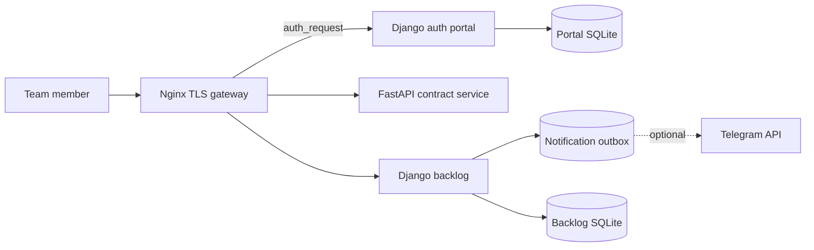

# GEO Tools Platform

A sanitized multi-service platform for local-search operations: authenticated access, a contract/report document service, and a workflow backlog with Telegram notification boundaries.

## Problem

Operational tools tend to grow as isolated scripts with separate credentials, inconsistent access control, and no shared deployment model. That makes day-to-day work fragile and migrations risky.

## Solution

This repository demonstrates a service-oriented monorepo with a Django authentication portal, FastAPI contract generator, Django backlog, reverse-proxy authorization, loopback-only application services, durable notification outbox, and environment-only secrets.

The UTM generator is maintained as a separate sanitized repository: [yandex-maps-utm-generator-public](https://github.com/vasceli/yandex-maps-utm-generator-public).

## Features

- Central Django session and group-based application access
- Mandatory password-change workflow
- Contract calculation, requisites parsing, preview, DOCX, and PDF generation
- Synthetic tariff and legal-requisites fixtures
- Backlog assignment, status, comments, saved filters, watchers, and completion evidence
- Telegram account linking and durable notification outbox
- Reverse-proxy `auth_request` pattern
- Environment-only secrets and local service bindings
- Automated tests across the three Python services

## Architecture



## Tech Stack

- Python, Django, FastAPI
- Gunicorn and Uvicorn
- SQLite
- Nginx and systemd templates
- python-docx, ReportLab, PyMuPDF, OpenPyXL
- Requests and optional SOCKS transport

## Running locally

Each service has its own requirements file. Copy `.env.example` to `.env`, replace all placeholders, and export the variables in your shell.

```bash
python -m pip install -r portal/requirements.txt
python portal/manage.py migrate
python portal/manage.py runserver 127.0.0.1:8000
```

```bash
python -m pip install -r contracts/requirements.txt
uvicorn backend.main:app --app-dir contracts --host 127.0.0.1 --port 8765
```

```bash
python -m pip install -r backlog/requirements.txt
python backlog/manage.py migrate
python backlog/manage.py runserver 127.0.0.1:5090
```

## Configuration

Secrets and hostnames are provided only through environment variables documented in `.env.example`. The checked-in values use reserved `example.com` hosts and non-working placeholders.

## Security

- No production IP, domain, SSH host/user/key, SOCKS topology, bot token, database, employee data, contract, client requisites, or generated document is included.
- Django signing keys are mandatory; unsafe fallback values were removed.
- Public services are designed to sit behind Nginx and bind to loopback.
- Contract CORS is deny-by-default and must be explicitly configured.
- Temporary passwords require replacement; Telegram linking uses one-time confirmation tokens; notifications use a durable outbox.
- Generated contracts and exports are excluded from Git.

## Project status

Production-derived portfolio version. Core service code is included; production deployment, live integrations, and infrastructure-specific recovery procedures are intentionally excluded.

## Privacy note

This public repository is a sanitized portfolio version of a private production project. Production credentials, client data, runtime databases and infrastructure-specific secrets are intentionally excluded.

All prices, names, addresses, identifiers, legal details, and examples in this repository are synthetic.
